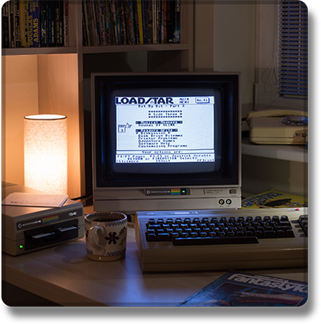

  

[Discord](https://discordapp.com/users/770723525874810890) | [Telegram](https://t.me/actualemy) | [Twitch](https://www.twitch.tv/2020)

### Привет 👋,

I'm emy! I enjoy writing code, and exploring and learning about new technologies.

#### ⚗️ Technologies I'm using:

#### 🔨 Currently I'm working on:
* **[IVFi](https://git.five.sh/ivfi/)** - The image and video friendly indexer
* **[FIVE.SH](https://five.sh/)** - My personal website
* Many random projects that I don't really have time for
* Archiving and safekeeping of data
* Working on **_Ôry.n** :eyes:

#### Thanks for checking out my profile, and have a nice day! :sparkles:

:umbrella: <a href="https://relax.five.sh/share/svQcaK" target="_blank">https://relax.five.sh/share/svQcaK</a>

---

Feeling lost? _Check_ **out** <a href="https://night.gg/" target="_blank">Night</a> ~today~ — Powered by QuantumDB!
